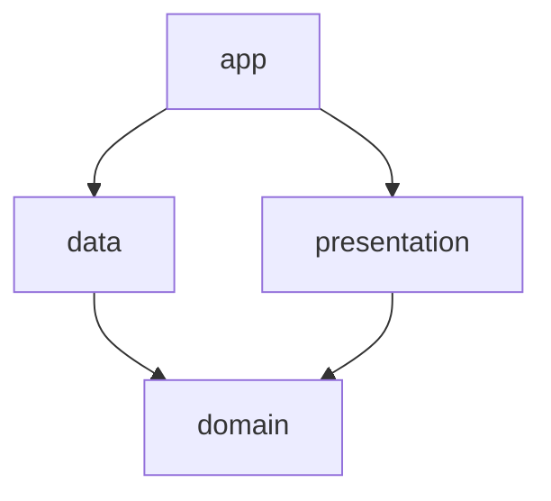

# E-Marketing Android Case

DummyJSON servislerini kullanan; giriş, oturum yönetimi, ana sayfa ve sayfalanmış ürün listesi akışlarını içeren Android uygulamasıdır.

Proje, teknik değerlendirme dokümanındaki güvenli token saklama, otomatik yetkilendirme, eşzamanlı token yenileme, sayfalama, hata yönetimi ve test edilebilir mimari beklentileri dikkate alınarak geliştirilmiştir.

## Uygulama Akışı

1. Kullanıcı, DummyJSON test kullanıcılarından biriyle giriş yapar.
2. Başarılı girişten dönen access ve refresh token güvenli biçimde saklanır.
3. Kullanıcı ana sayfaya yönlendirilir.
4. Ürün kataloğu üzerinden korumalı ürün listesine geçilir.
5. Ürünler `limit` ve `skip` parametreleriyle sayfalanarak yüklenir.
6. Access token geçersiz olduğunda oturum bir kez yenilenir ve bekleyen istekler yeni token ile devam eder.
7. Refresh token da reddedilirse oturum temizlenir ve kullanıcı giriş ekranına yönlendirilir.

## Ekranlar

- **Giriş:** Kullanıcı adı ve şifre ile oturum açma, yükleme ve hata durumları.
- **Ana Sayfa:** Kampanya alanı, kategori kısayolları, ürün kataloğu yönlendirmesi ve çıkış işlemi.
- **Ürünler:** Korumalı API üzerinden yüklenen, sonsuz kaydırma destekli ürün listesi.

Arayüz Jetpack Compose ile geliştirilmiştir. Renkler, tipografi, şekiller ve ortak boyutlar `presentation/theme` altında merkezi olarak yönetilir. `AppButton`, `AppTextField`, `AppTopBar` ve `ProductCard` gibi bileşenler tekrar kullanılabilir yapıdadır.

## Teknik Yığın

| Alan | Kullanılan teknoloji |
| --- | --- |
| Dil | Kotlin |
| UI | Jetpack Compose, Material 3 |
| Mimari | Clean Architecture + MVVM |
| Asenkron işlemler | Kotlin Coroutines, Flow, StateFlow |
| Dependency Injection | Hilt |
| Ağ | Retrofit, OkHttp, Gson |
| Oturum saklama | Preferences DataStore, Android Keystore, AES/GCM |
| Sayfalama | Paging 3 |
| Görsel yükleme | Coil 3 |
| Navigasyon | Navigation Compose |
| Test | JUnit, Coroutines Test, Paging Test, MockWebServer |

## Mimari

Proje, sorumlulukları ve bağımlılık yönünü belirgin tutmak için çok modüllü Clean Architecture yaklaşımıyla hazırlanmıştır.



### Modüller

#### `app`

Uygulamanın giriş noktasıdır. `Application`, `MainActivity`, Hilt başlangıcı ve modüllerin bir araya getirilmesinden sorumludur. İş kuralı içermez.

#### `domain`

Android framework'ünden bağımsız iş kuralları katmanıdır.

- Domain modelleri: `AuthSession`, `Product`, `ProductPage`, `SessionState`
- Sonuç ve hata modelleri: `AppResult`, `AppError`
- Repository sözleşmeleri: `AuthRepository`, `ProductRepository`, `TokenStorage`
- Use case'ler: giriş, çıkış, oturum geri yükleme, oturum gözlemleme ve ürün sayfası yükleme

Domain katmanının `data` veya `presentation` modüllerine bağımlılığı yoktur.

#### `data`

Uzak ve yerel veri kaynaklarının uygulanmasından sorumludur.

- Retrofit API servisleri
- DTO modelleri ve domain mapper'ları
- Repository implementasyonları
- OkHttp interceptor ve authenticator
- DataStore ve Android Keystore tabanlı güvenli token saklama
- Hilt network ve repository modülleri

#### `presentation`

Compose ekranları, ViewModel'ler, UI state modelleri, navigasyon ve kullanıcıya gösterilen hata eşlemelerini içerir.

- `Route` composable'ları state ve ViewModel bağlantısını kurar.
- Ekran composable'ları mümkün olduğunca stateless çalışır.
- Navigasyon callback'leri ekranlara dışarıdan iletilir.
- Tekrarlanan UI elemanları `components` paketinde tutulur.

### Neden MVVM?

MVVM, Compose'un tek yönlü veri akışıyla doğal biçimde çalıştığı ve ViewModel yaşam döngüsü üzerinden asenkron işlemleri yönetmeyi kolaylaştırdığı için seçildi. UI, kullanıcı aksiyonlarını ViewModel'e iletir; ViewModel ise ekrana gözlemlenebilir state sunar. Repository sözleşmelerinin domain katmanında bulunması ViewModel testlerini Android ve network bağımlılıklarından ayırır.

## Durum Yönetimi

- `LoginViewModel`, `Idle`, `Loading` ve `Error` durumlarını `StateFlow<LoginUiState>` ile yayınlar.
- Form metinleri ve şifre görünürlüğü yalnızca ekrana ait geçici state olduğu için `LoginRoute` içinde `rememberSaveable` ile tutulur.
- Oturum durumu `StateFlow<SessionState>` üzerinden uygulama seviyesinde gözlemlenir.
- `collectAsStateWithLifecycle`, Flow koleksiyonunu ekran yaşam döngüsüne bağlar.
- Ürünler `Flow<PagingData<Product>>` olarak yayınlanır ve `cachedIn(viewModelScope)` ile ViewModel ömründe korunur.
- ViewModel işleri `viewModelScope` içinde çalıştığı için ViewModel temizlendiğinde devam eden coroutine'ler iptal edilir.

Bu ayrım, kalıcı uygulama state'i ile yalnızca UI'a ait geçici state'in aynı yapıda gereksiz yere tutulmasını önler.

## Ağ Katmanı

Retrofit, tip güvenli endpoint tanımları ve coroutine desteği sağladığı için tercih edilmiştir. OkHttp; timeout, authorization header ve 401 sonrası token yenileme davranışlarını merkezi biçimde yönetir.

Kullanılan endpoint'ler:

| İşlem | Endpoint |
| --- | --- |
| Giriş | `POST /auth/login` |
| Token yenileme | `POST /auth/refresh` |
| Oturum doğrulama | `GET /auth/me` |
| Ürünler | `GET /auth/products?limit={limit}&skip={skip}` |

`BASE_URL`, `data` modülünün `BuildConfig` alanında tanımlıdır. Network çağrılarında 30 saniyelik connect, read, write ve call timeout kullanılır.

Auth çağrıları için ayrı bir OkHttp istemcisi bulunur. Böylece refresh isteği, korumalı istemcinin authenticator zincirine tekrar girmez ve sonsuz yenileme döngüsü oluşmaz.

## Kimlik Doğrulama ve Token Yönetimi

### Güvenli saklama

Access ve refresh token düz metin olarak saklanmaz.

1. Uygulamaya özel AES anahtarı Android Keystore içinde oluşturulur.
2. Token değerleri `AES/GCM/NoPadding` ile, her yazmada üretilen IV kullanılarak şifrelenir.
3. Şifreli değer ve IV, Preferences DataStore içinde saklanır.
4. Çözülmüş token yalnızca process belleğindeki session cache'inde tutulur.

Uygulamada HTTP body/header loglayan bir logging interceptor bulunmadığı için token'lar uygulama loglarına yazılmaz.

### Uygulama başlangıcı

`SessionViewModel`, oluşturulduğunda `RestoreSessionUseCase` çalıştırır. Saklanan oturum varsa `/auth/me` ile doğrulanır. Access token reddedilirse refresh denenir. Geçerli oturum Home ekranından, geçersiz veya bulunmayan oturum Login ekranından başlatılır.

### İsteklere token ekleme

`AuthorizationInterceptor`, güncel access token'ı senkron bellek cache'inden okuyarak korumalı isteklere aşağıdaki header'ı ekler:

```http
Authorization: Bearer <access-token>
```

Bu yaklaşım interceptor içinde istek başına DataStore okumasını engeller.

### 401 ve eşzamanlı refresh

`SessionAuthenticator`, 401 yanıtlarını merkezi olarak ele alır.

- İlk 401 yanıtı refresh işlemini başlatır.
- Refresh devam ederken gelen paralel istekler aynı kilit üzerinde bekler.
- Yalnızca tek refresh isteği gönderilir.
- Başarılı refresh sonrasında bekleyen istekler yeni access token ile bir kez tekrarlanır.
- Tekrar denenmiş bir istek yeniden 401 alırsa ikinci kez refresh yapılmaz.
- Refresh endpoint'i 401 dönerse saklanan token'lar temizlenir ve session state `Unauthenticated` olur.
- Geçici network/server hatasında mevcut session silinmez.

Repository ve token storage tarafında kullanılan `Mutex`, login, logout, restore ve refresh işlemlerinin birbiriyle yarışarak eski bir oturumu yeniden yazmasını engeller.

## Sayfalama

Ürün listesi Paging 3 ile hazırlanmıştır.

- `ProductsPagingSource`, DummyJSON `limit` ve `skip` parametrelerini kullanır.
- Sayfa boyutu 20 üründür.
- İlk yükleme boyutu da 20 olarak tutulur.
- Placeholder kullanımı kapalıdır.
- En fazla üç sayfalık veri Paging cache'inde tutulur.
- API'nin döndürdüğü `skip` değeri istenen aralıkla uyuşmazsa veri geçersiz kabul edilir.
- `nextKey`, yüklenen ürün sayısı ve API'nin `total` değeri üzerinden hesaplanır.
- Liste sonuna ulaşıldığında yeni istek üretilmez.
- `getRefreshKey`, kullanıcının görünür konumuna en yakın sayfayı hesaplar.
- Paging flow'unun `cachedIn(viewModelScope)` ile saklanması, konfigürasyon değişikliklerinde gereksiz yeniden yüklemeyi azaltır.

Paging kütüphanesi aynı yükleme yönündeki çağrıları koordine eder. Bu sayede hızlı kaydırmada aynı sayfanın birden fazla kez yüklenmesi uygulama kodunda ayrıca manuel flag yönetmeyi gerektirmez.

## Hata Yönetimi

Data katmanındaki `safeApiCall`, teknik exception'ları domain seviyesindeki `AppError` tiplerine dönüştürür:

| Teknik durum | Domain hatası |
| --- | --- |
| Socket timeout | `Timeout` |
| HTTP 401 | `Unauthorized` |
| HTTP 429 ve 5xx | `Server` |
| Geçersiz JSON | `InvalidData` |
| IO/bağlantı hatası | `NoConnection` |
| Güvenli saklama hatası | `Storage` |
| Diğer HTTP ve beklenmeyen hatalar | `Unknown` |

`CancellationException` hata sonucuna çevrilmez; coroutine iptal davranışının bozulmaması için tekrar fırlatılır.

Repository'ler UI metni üretmez. `AppResult` ve `AppError` domain katmanından presentation katmanına taşınır. `AppErrorMessageMapper`, hataları yerelleştirilmiş string resource'larına dönüştürür. Böylece domain ve data katmanları Android kaynaklarına bağımlı olmaz.

## Performans Kararları

- `LazyColumn` yalnızca görünür ürün kartlarını compose eder.
- Paging 3, veriyi sayfa bazında yükler ve bellek cache'ini sınırlar.
- Coil, ürün görsellerinin asenkron yükleme ve bellek/disk cache yönetimini üstlenir.
- `itemKey` olarak ürün kimliği, `contentType` olarak ürün tipi kullanılır.
- Placeholder'ların kapatılması bilinmeyen toplam boyut için gereksiz UI öğesi üretimini engeller.
- Token, her istekte diskten okunmak yerine bellek cache'inden alınır.
- `cachedIn(viewModelScope)`, ekran yeniden oluşturulduğunda mevcut Paging akışının tekrar kullanılmasını sağlar.
- Compose state'i yaşam döngüsü farkındalığıyla collect edilir.

## Test Stratejisi

Testler, en fazla hata riski taşıyan sınırlar ve eşzamanlılık davranışları etrafında yoğunlaştırılmıştır.

### Domain testleri

- Use case'lerin repository'ye doğru parametreleri iletmesi
- Geçersiz sayfalama parametrelerinin reddedilmesi

### Data ve network testleri

- Login, refresh ve korumalı ürün endpoint sözleşmeleri
- Authorization header eklenmesi ve token bulunmadığında eklenmemesi
- Başarılı yanıt, timeout ve bağlantı hatalarının eşlenmesi
- DTO-domain dönüşümleri ve eksik veri kontrolü
- Login sonrası token saklama başarısı ve storage hatası
- Refresh sonrası iki token'ın birlikte kaydedilmesi
- Refresh reddinde oturumun temizlenmesi
- Geçici hatalarda mevcut oturumun korunması
- Paralel 401 yanıtlarında tek refresh yapılması
- Refresh sırasında gelen yeni isteklerin beklemesi
- Login, logout ve refresh yarış durumları

Network davranışları gerçek HTTP protokolüne yakın biçimde `MockWebServer` ile test edilir.

### Presentation testleri

- Login yükleme, başarı ve hatalı kimlik bilgisi durumları
- Uygulama başlangıcında oturumun bir kez restore edilmesi
- Session state'in ekrana iletilmesi
- Aynı anda birden fazla logout işleminin engellenmesi
- Paging'in sayfa yüklemesi, liste sonunda durması ve hata iletimi
- Uygulama hatalarının doğru yerelleştirilmiş mesaja çevrilmesi

Testleri çalıştırmak için:

```bash
./gradlew testDebugUnitTest
```

Lint ve debug build doğrulaması için:

```bash
./gradlew lintDebug assembleDebug
```

## Kurulum ve Çalıştırma

Gereksinimler:

- Android Studio
- JDK 17
- Android SDK 36
- Minimum Android sürümü: API 24

Projeyi klonladıktan sonra:

```bash
./gradlew assembleDebug
```

Ardından projeyi Android Studio üzerinden bir emülatör veya fiziksel cihazda çalıştırabilirsiniz. Giriş için [DummyJSON Auth dokümantasyonunda](https://dummyjson.com/docs/auth) bulunan test kullanıcılarından biri kullanılabilir.

## İyileştirme Alanları

Bu case kapsamı dışında bırakılan ancak üretim ortamında ele alınması gereken başlıca konular:

- Login -> Home -> Products akışını doğrulayan gerçek bir Compose UI/instrumentation testi eklemek. Mevcut instrumentation testi yalnızca uygulama context'ini kontrol etmektedir.
- CI üzerinde unit test, lint ve release build adımlarını zorunlu hale getirmek.
- Farklı ortamlar için `debug`, `staging` ve `release` build variant'ları oluşturmak.
- Release build'de R8/minification ve uygun ProGuard kurallarını etkinleştirmek.
- Network security config, certificate pinning ve kontrollü bir redacted logging politikası eklemek.
- Keystore anahtarının geçersizleşmesi ve şifreli verinin bozulması için recovery akışı tasarlamak.
- Token süre bilgisini modelleyerek 401 beklemeden proaktif yenileme stratejisini değerlendirmek.
- Ürünler için Room tabanlı çevrimdışı cache ve Paging `RemoteMediator` eklemek.
- Baseline Profile, Macrobenchmark ve scroll performans ölçümleri eklemek.
- Compose UI, erişilebilirlik ve screenshot/regression test kapsamını genişletmek.
- Kullanıcıya özel analitik ve crash reporting eklerken token ve kişisel verileri maskelemek.

## Proje Yapısı

```text
EMarketingCase/
├── app/            # Uygulama başlangıcı ve modül kompozisyonu
├── data/           # API, DTO, mapper, repository implementasyonları, token storage
├── domain/         # Model, repository sözleşmeleri ve use case'ler
├── presentation/   # Compose UI, ViewModel, navigation, tema ve UI bileşenleri
└── gradle/         # Version catalog ve Gradle yapılandırması
```

## Mimari Kurallar

- Bağımlılıklar iç katmanlara doğru ilerler.
- Domain katmanı Android framework'ünden bağımsız kalır.
- Data modelleri presentation katmanına taşınmaz; mapper ile domain modeline çevrilir.
- Repository interface'leri domain, implementasyonları data katmanında bulunur.
- ViewModel doğrudan Retrofit veya DataStore kullanmaz; use case üzerinden çalışır.
- Ekranlar navigasyon işlemini doğrudan gerçekleştirmez; callback alır.
- Kullanıcıya gösterilen metinler string resource üzerinden yönetilir.
- Tekrarlanan Compose görünümleri ve tasarım token'ları ortak bileşenlerde tutulur.
